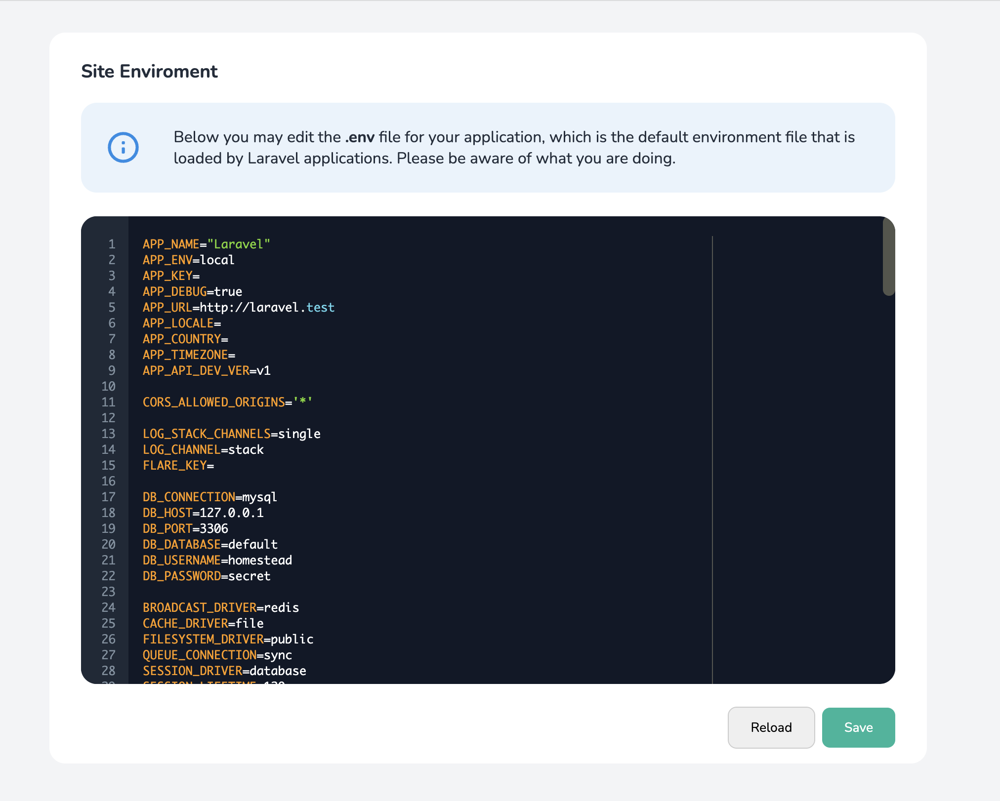

## About This package
This package allows you to edit your .env file directly in your project.
The idea to built it was after we moved our project from Forge to AWS and we wanted to keep the same experience that Forge provide when you edit the environment file.
I tried also to keep the same Forge styles and behaviour (Because Forge is 💪).



## How to Install?
`composer require mohkoma/laravel-env-editor`

Then you need to publish the assets
`php artisan vendor:publish --tag=env-editor-assets`

## Requires
PHP >= 7.4
Laravel >= 7.0

## Usage
After you install the package you should be ready to go, The default route to access the editor is `/dev/environment` but you could also change from the config file.
To publish the config file, just run:
`php artisan vendor:publish --tag=env-editor-config`

In case if you want to customise your view, you can publish the view file using
`php artisan vendor:publish --tag=env-editor-views`

Please, Be sure that you give the right permissions using middlewares
```php
<?php

return [

    /**
     *  The middlewares for the env's routes
     */
    'middlewares' => [
        //\Illuminate\Auth\Middleware\AuthenticateWithBasicAuth::class
    ],
```